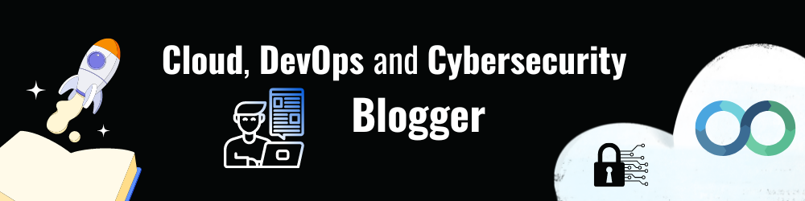

# Welcome to My CloudBlogs Repo☁

Welcome to my blog, where I'll be sharing insights and inspiration about cloud computing, DevOps, infrastructure as code, and a variety of other topics related to the field of information technology. This is a space where I can share my thoughts, experiences, and knowledge with the community, and I hope that it will be a source of inspiration and learning for others who are interested in these topics.
 
 
 

 

# Current Blog List

I am passionate about the latest developments in tech, and I hope that through my blog, I can help others to do the same. Whether you're just starting out in the tech industry or are a seasoned professional looking to deepen your knowledge, I hope that you will find something of value here. 

Thank you for stopping by! Happy reading.

<!-- HASHNODE_BLOG:START -->

- [AWS Developer Exam Study Guide: Resources, Tips, and Strategies](https://blog.yahya-abulhaj.dev//aws-developer-exam-study-guide-resources-tips-and-strategies)
- [Quickstart Ruby On Rails](https://blog.yahya-abulhaj.dev//quickstart-ruby-on-rails)
- [Mastering Python and Bash for Next-Level Automation](https://blog.yahya-abulhaj.dev//mastering-python-and-bash-for-next-level-automation)
- [Monitoring Made Easy with Prometheus](https://blog.yahya-abulhaj.dev//monitoring-made-easy-with-prometheus)
- [Ansible: A Practical Guide to Configuration Management](https://blog.yahya-abulhaj.dev//ansible-a-practical-guide-to-configuration-management)
- [Unleashing the Power of Cloud-Native Technologies](https://blog.yahya-abulhaj.dev//unleashing-the-power-of-cloud-native-technologies)
- [HELM -  The Essential Package Manager for Kubernetes](https://blog.yahya-abulhaj.dev//helm-the-essential-package-manager-for-kubernetes)
- [YAML Ain’t Markup Language](https://blog.yahya-abulhaj.dev//yaml-aint-markup-language)
- [KUBERNETES - The Containers Orchestration Engine](https://blog.yahya-abulhaj.dev//kubernetes-the-containers-orchestration-engine)
- [Why Skype for Business is Good for You](https://blog.yahya-abulhaj.dev//why-skype-for-business-is-good-for-you)
- [Let's Explain a Pipeline](https://blog.yahya-abulhaj.dev//lets-explain-a-pipeline)
- [Microsoft Ignite Event: Free Exam Voucher](https://blog.yahya-abulhaj.dev//microsoft-ignite-event-free-exam-voucher)
- [Microsoft Certified:CyberSecurity Architect Expert - Resources](https://blog.yahya-abulhaj.dev//microsoft-certifiedcybersecurity-architect-expert-resources)
- [Microsoft Certified: Azure Solutions Architect Expert - Resources](https://blog.yahya-abulhaj.dev//microsoft-certified-azure-solutions-architect-expert-resources)
- [Microsoft Certified: DevOps Engineer Expert - Resources](https://blog.yahya-abulhaj.dev//microsoft-certified-devops-engineer-expert-resources)
- [Microsoft Certified: Security Operations Analyst Associate - Resources](https://blog.yahya-abulhaj.dev//microsoft-certified-security-operations-analyst-associate-resources)
- [Microsoft Certified: Azure Security Engineer Associate - Resources](https://blog.yahya-abulhaj.dev//microsoft-certified-azure-security-engineer-associate-resources)
- [Microsoft Certified: Azure Network Engineer Associate - Resources](https://blog.yahya-abulhaj.dev//microsoft-certified-azure-network-engineer-associate-resources)
- [AWS Certified: Cloud Practitioner Certification](https://blog.yahya-abulhaj.dev//aws-certified-cloud-practitioner-certification)
- [Microsoft Intune - Control Over Your Devices](https://blog.yahya-abulhaj.dev//microsoft-intune-control-over-your-devices)
- [Cleaning up your Microsoft Azure Account](https://blog.yahya-abulhaj.dev//cleaning-up-your-microsoft-azure-account)
- [Wish_List Certifications](https://blog.yahya-abulhaj.dev//wishlist-certifications)
- [On board to Sentinel And Defender](https://blog.yahya-abulhaj.dev//on-board-to-sentinel-and-defender)
- [Git/GitHub Workflow in 80 seconds](https://blog.yahya-abulhaj.dev//gitgithub-workflow-in-80-seconds)
- [Containers, Docker - What exactly is that?](https://blog.yahya-abulhaj.dev//containers-docker-or-what-exactly-is-that)
- [IT - General Culture](https://blog.yahya-abulhaj.dev//it-general-culture)
- [Automate the CI/CD Pipeline using Harness.io](https://blog.yahya-abulhaj.dev//automate-the-cicd-pipeline-using-harnessio)
- [Microsoft Certified: Azure Developer Associate - Study Guide](https://blog.yahya-abulhaj.dev//microsoft-certified-azure-developer-associate-or-study-guide)
- [Cost Management and Cloud Migration - Microsoft Azure Edition](https://blog.yahya-abulhaj.dev//cost-management-and-cloud-migration-or-microsoft-azure-edition)
- [NotLocalHost  - Free Hosting & Serverless  Services](https://blog.yahya-abulhaj.dev//notlocalhost-or-free-hosting-and-serverless-services)
- [Host Your Application Using Azure Blob Storage & CloudFlare | DNS Configuration](https://blog.yahya-abulhaj.dev//host-your-application-using-azure-blob-storage-and-cloudflare-or-dns-configuration)
- [Microsoft Build 2022: Cloud Skills Challenge  - Free Microsoft Certification Voucher](https://blog.yahya-abulhaj.dev//microsoft-build-2022-cloud-skills-challenge-free-microsoft-certification-voucher)
- [Why HashiCorp Terraform? - Certification Resources](https://blog.yahya-abulhaj.dev//why-hashicorp-terraform-certification-resources)
- [Microsoft Certified: The Renewal Process](https://blog.yahya-abulhaj.dev//microsoft-certified-the-renewal-process)
- [Passing Microsoft Azure Administrator Associate Certification](https://blog.yahya-abulhaj.dev//passing-microsoft-azure-administrator-associate-certification)
- [Getting started with Microsoft Azure Fundamentals Certifications](https://blog.yahya-abulhaj.dev//getting-started-with-microsoft-azure-fundamentals-certifications)

<!-- HASHNODE_BLOG:END -->

 

Outro

The cloud has been a pivotal part of my journey as a technologist. As someone who works in the field of DevOps, I have seen firsthand how the cloud can transform the way organizations operate and deliver value to their customers. 
   

In my current role, I am focused on improving my skills in multi-cloud environments, including Azure, Google Cloud Platform, and Amazon Web Services. I believe that having a strong foundation in multiple cloud platforms allows me to better serve the needs of my clients and add value to the world.

 

Adding on that, working with the cloud has opened up many opportunities for me and has helped me to grow as a professional. 

 
I am excited to continue learning and exploring all that the cloud has to offer and more importantly, <b>**[giving back to the community](details.md)**<b>. 

